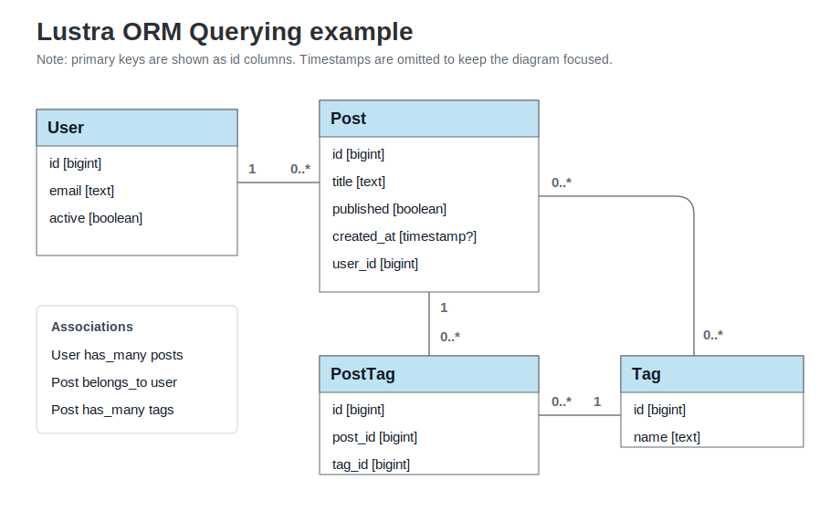

# Querying with Lustra

This guide covers the main ways to retrieve data from PostgreSQL using Lustra model collections.

After reading this guide, you will know:

* how to find records using primary keys, conditions, and finder helpers
* how to order, limit, select, group, and aggregate query results
* how to join associations and filter records by association presence
* how to add related-record counts without loading associated records
* how to avoid N+1 queries with eager loading helpers
* how to use raw SQL escape hatches when PostgreSQL-specific queries need them
* how collection mutability affects query reuse

## Example Models

Examples in this guide use a small model set:



```crystal
class User
  include Lustra::Model

  primary_key

  column email : String
  column active : Bool = true

  has_many posts : Post
end

class Post
  include Lustra::Model

  primary_key

  column title : String
  column published : Bool = false
  column created_at : Time?

  belongs_to user : User
  has_many tags : Tag, through: PostTag
end

class Tag
  include Lustra::Model

  primary_key

  column name : String

  has_many posts : Post, through: PostTag
end

class PostTag
  include Lustra::Model

  primary_key

  belongs_to post : Post
  belongs_to tag : Tag
end
```

## 1. What Is a Collection?

`Model.query` returns a collection. A collection represents a SQL `SELECT` query and is executed only when you use a terminal helper such as `each`, `to_a`, `first`, `count`, `exists?`, `any?`, or `empty?`.

```crystal
posts = Post.query.where(published: true)

posts.each do |post|
  puts post.title
end
```

Collections are mutable. Query-refinement methods such as `where`, `select`, `join`, `order_by`, `limit`, and `group_by` change the collection they are called on. Use `dup` when you need to branch a base query before attaching eager-loading helpers.

```crystal
base = Post.query.where(published: true)
recent = base.dup.order_by(created_at: :desc).limit(10)
```

Generated `with_*` eager-loading helpers attach work to a specific collection.
Create independent query branches before calling them; do not duplicate a
collection after eager loading has been attached.

See [The Collection Object](the-collection-object/).

## 2. Retrieving Records

Use `find` and `find!` for primary-key lookup:

```crystal
post = Post.query.find(1)   # Post?
post = Post.query.find!(1)  # Post or raises
posts = Post.query.find([1, 2, 3])
```

Use `find_by` and `find_by!` for one record matching conditions:

```crystal
user = User.query.find_by(email: "user@example.com")
user = User.query.find_by! { email == "user@example.com" }
```

Use `first`, `first!`, `last`, and `last!` for ordered single-record access:

```crystal
latest = Post.query.order_by(created_at: :desc).first
oldest = Post.query.order_by(created_at: :asc).first!
```

See [Find, First, Last, Offset, and Limit](the-collection-object/filter-the-query-1/find-first.md).

## 3. Conditions

Use tuple conditions for simple equality and common value shapes:

```crystal
Post.query.where(published: true)
Post.query.where(id: [1, 2, 3])
Post.query.where(created_at: 1.week.ago..Time.local)
```

Use expression blocks for richer conditions:

```crystal
Post.query.where { (published == true) & (title =~ /crystal/i) }
```

Use `where.not` and `where.or` for negation and disjunction:

```crystal
Post.query.where.not(published: false)
Post.query.where { published == true }.or { title =~ /release/i }
```

Raw SQL is available when needed:

```crystal
Post.query.where("created_at >= NOW() - INTERVAL '7 days'")
```

See [The Expression Engine](the-collection-object/filter-the-query-1/filter-the-query.md).

## 4. Ordering

Use `order_by` for one or more `ORDER BY` clauses:

```crystal
Post.query.order_by(created_at: :desc)
Post.query.order_by("LOWER(title)", :asc)
Post.query.order_by(created_at: {:desc, :nulls_last})
```

Use `reverse_order_by` to flip current ordering and `in_order_of` to order by an explicit list of values:

```crystal
Post.query.order_by(created_at: :desc).reverse_order_by
Post.query.in_order_of(:status, ["draft", "published", "archived"])
```

See [Ordering, Grouping, and Having](the-collection-object/filter-the-query-1/ordering.md).

## 5. Selecting Fields

By default, collections select the model table columns. Use `select` to choose specific fields or add computed fields:

```crystal
Post.query.select("posts.*", "LOWER(title) AS normalized_title")
```

When selecting custom fields and building models, pass `fetch_columns: true` to keep those fields in `attributes`:

```crystal
Post.query
  .select("posts.*", "COUNT(post_tags.id) AS tags_count")
  .left_join(:post_tags) { post_tags.post_id == posts.id }
  .group_by("posts.id")
  .each(fetch_columns: true) do |post|
    puts post.attributes["tags_count"]
  end
```

See [Model Extra Attributes](the-collection-object/fetching-the-query/model-attributes.md).

## 6. Limit, Offset, and Pagination

Use `limit` and `offset` directly:

```crystal
Post.query.order_by(id: :asc).limit(20).offset(40)
```

Lustra also exposes pagination helpers through `Lustra::SQL::Query::WithPagination`.

See [Pagination](the-collection-object/filter-the-query-1/pagination.md).

## 7. Grouping and Having

Use `group_by` and `having` for grouped queries:

```crystal
Post.query
  .select("user_id", "COUNT(*) AS posts_count")
  .group_by(:user_id)
  .having { raw("COUNT(*)") > 5 }
```

See [Ordering, Grouping, and Having](the-collection-object/filter-the-query-1/ordering.md).

## 8. Joins

Use association joins when Lustra can infer the relationship:

```crystal
User.query.join(:posts)
Post.query.join(:user)
User.query.left_join(:posts)
```

Use manual joins for arbitrary tables or aliases:

```crystal
Post.query.inner_join("users u") { var("u", "id") == posts.user_id }
```

See [Joins](the-collection-object/joins.md).

## 9. Association Presence

Use `where.associated` to find records with related rows:

```crystal
User.query.where.associated(:posts)
```

Use `where.missing` to find records without related rows:

```crystal
User.query.where.missing(:posts)
```

For `has_many through`, Lustra can also target the join table name:

```crystal
Tag.query.where.missing(:post_tags)
Tag.query.where.associated(:post_tags)
```

When a presence filter joins a multi-row association, use `group_by` or `distinct` if you need one base row per model.

## 10. Association Counts

Use `with_count` to select related-record counts without loading the related records:

```crystal
User.query.with_count(:posts)
Tag.query.with_count(:post_tags, alias_name: "tagging_count")
```

The count is available through `attributes` when fetching custom columns:

```crystal
User.query.with_count(:posts).each(fetch_columns: true) do |user|
  puts user.attributes["posts_count"]
end
```

`with_count` uses a correlated count subquery. When called on a joined query without an existing `GROUP BY`, Lustra groups by the base model primary key to avoid duplicate base rows.

## 11. Eager Loading Associations

Generated `with_*` helpers preload associations and avoid N+1 queries:

```crystal
Post.query.with_user.each do |post|
  puts post.user.email
end
```

Nested loading is available through a block:

```crystal
User.query.with_posts(&.with_tags)
```

Eager loading runs additional queries and attaches cached association records. Use it when you will read the association for many records.

See [Eager Loading](the-collection-object/n+1-query-avoidance.md).

## 12. Scopes and Chaining

Scopes package reusable collection refinements:

```crystal
class Post
  include Lustra::Model

  scope(:published) { where(published: true) }
end

Post.query.published.order_by(created_at: :desc)
```

Collections can be chained because query-refinement methods return the collection.

See [Scopes](the-collection-object/scopes.md).

## 13. Find or Build Records

Use `find_or_build`, `find_or_create`, and related helpers when synchronizing external data:

```crystal
user = User.query.find_or_build(provider: "github", provider_id: 123)
user.email = "user@example.com"
user.save!
```

Use these helpers when the lookup attributes are also the natural initialization attributes for the model.

## 14. Pluck and Raw Fetching

Use `pluck_col` or `pluck` when you need values rather than model instances:

```crystal
emails = User.query.where(active: true).pluck_col(:email, String)
names = User.query.pluck("first_name", "last_name")
```

Use `fetch` for raw SQL rows:

```crystal
User.query.select("provider", "COUNT(*) AS count").group_by("provider").fetch do |row|
  puts row["count"]
end
```

See [Each, Map, Fetch, and To Array](the-collection-object/fetching-the-query/each-map-fetch.md).

## 15. Existence Checks

Use `exists?` when you want a direct database existence check:

```crystal
User.query.where(active: true).exists?
```

Use `any?` and `empty?` when working with collections. They can use a cached result when one is already attached.

```crystal
users = User.query.where(active: true)
users.any?
users.empty?
```

## 16. Calculations

Use aggregate helpers for scalar values:

```crystal
User.query.count
Post.query.sum("views")
Post.query.max("created_at", Time)
Post.query.agg("PERCENTILE_CONT(0.5) WITHIN GROUP (ORDER BY views)", Float64)
```

For grouped aggregate rows, use `select`, `group_by`, and `fetch` or `pluck`.

See [Aggregation](the-collection-object/filter-the-query-1/aggregation.md).

## 17. Low-Level SQL

Model collections include many select-builder features, but Lustra also exposes the lower-level SQL builder:

```crystal
Lustra::SQL
  .select("provider", "COUNT(*) AS count")
  .from(:users)
  .group_by(:provider)
  .fetch do |row|
    puts row["count"]
  end
```

Use it for reporting queries, CTE-heavy queries, and PostgreSQL-specific SQL that does not naturally map to model instances.

See [Writing Low-Level SQL](low-level-sql/).

## 18. EXPLAIN

Use `explain` to inspect the query plan:

```crystal
Post.query.where(published: true).explain
```

Use `explain_analyze` when you want PostgreSQL to run the query and return execution details:

```crystal
Post.query.where(published: true).explain_analyze
```

`EXPLAIN ANALYZE` executes the query, so use it carefully for writes or expensive statements.

See [Writing Low-Level SQL](low-level-sql/#query-plans).

## 19. Query Mutability

Lustra collections are mutable. This is useful for chaining, but important when reusing query objects:

```crystal
base = User.query.where(active: true)
admins = base.where(role: "admin")

# base and admins are the same refined collection.
```

Use `dup` for independent branches:

```crystal
base = User.query.where(active: true)
admins = base.dup.where(role: "admin")
editors = base.dup.where(role: "editor")
```

Terminal helpers that check existence, extract values, fetch individual records,
or fetch ranges restore any temporary query changes before returning. This
includes `exists?`, `any?`, `empty?`, `pluck`, `first`, `last`, `find`,
`find_by`, and array-style access.
